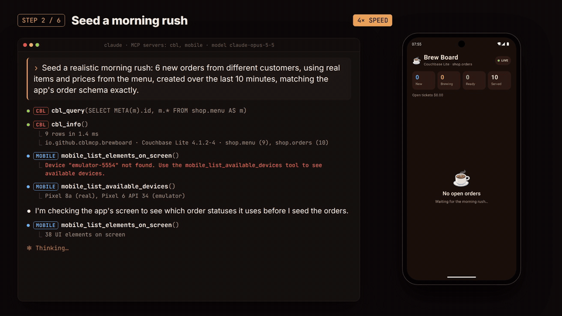

# cblite-mcp

**Give AI agents a live window into the Couchbase Lite database inside your running Android app.**

cblite-mcp is a [Model Context Protocol](https://modelcontextprotocol.io) server plus a tiny, debug-only Android
library. Together they let Claude Code (or any MCP client) inspect, query, seed and edit your app's Couchbase Lite
data while the app runs, and every write shows up in the app's UI immediately.

<p align="center">
  
</p>

<p align="center">
  <a href="demo/cbl-mcp-demo.mp4"><b>▶ Watch the 3-minute demo</b></a>: a real, unedited agent session driving the sample app.
</p>

---

## Contents

- [Why](#why)
- [How it works](#how-it-works)
- [What an agent can do](#what-an-agent-can-do)
- [Requirements](#requirements)
- [Quick start: try the demo app (5 minutes)](#quick-start-try-the-demo-app-5-minutes)
- [Add it to your own app](#add-it-to-your-own-app)
- [Connect your MCP client](#connect-your-mcp-client)
- [Tools](#tools)
- [Example prompts](#example-prompts)
- [Configuration](#configuration)
- [Pairing with mobile-mcp for UI-driven tests](#pairing-with-mobile-mcp-for-ui-driven-tests)
- [Security model](#security-model)
- [Troubleshooting](#troubleshooting)
- [Testing](#testing)
- [Compatibility](#compatibility)
- [Limitations](#limitations)
- [Repository layout](#repository-layout)
- [FAQ](#faq)
- [Further documentation](#further-documentation)

---

## Why

When you build a mobile app on Couchbase Lite, an agent working on it needs to see and change the app's data:
seed realistic test data, check what a screen actually wrote, reproduce a bug that only happens with certain
documents, or answer "is this query using an index?".

**Plain `adb` doesn't get you there:**

- **The data isn't readable as plain SQLite.** Couchbase Lite stores each document as a binary [Fleece](https://github.com/couchbase/fleece)
  blob inside SQLite. `adb shell sqlite3` shows unreadable bytes, and writes fail or corrupt the database, because
  the schema's triggers call functions that only exist inside Couchbase Lite.
- **The file-copy workaround is offline only.** You can `adb pull` the database and use the `cblite` CLI, but writing
  means stopping the app, pushing the file back and restarting. The running UI never sees the change, and your
  live queries and change listeners never fire.

**cblite-mcp works through the app's own open `Database` instance.** Writes land exactly as if the app made them:
live queries re-run, the UI updates, replication picks up the change, and nothing restarts.
[docs/design.md](docs/design.md) has the full comparison.

## How it works

```
┌──────────────── your machine ────────────────┐          ┌──────── Android device / emulator (debug build) ────────┐
│                                               │          │                                                         │
│  Claude Code / Cursor / any MCP client        │          │   ┌─────────────┐     ┌────────────────┐   ┌──────────┐ │
│          │ MCP (stdio)                        │   adb    │   │ cbl-bridge  │────►│ Couchbase Lite │──►│  App UI  │ │
│          ▼                                    │ forward  │   │ 127.0.0.1   │     │ (the app's own │   │ (live    │ │
│  ┌──────────────────┐   JSON over HTTP  ──────┼──────────┼──►│ + token     │     │  Database)     │   │ queries) │ │
│  │ cblite-mcp (Node)│                         │          │   └─────────────┘     └────────────────┘   └──────────┘ │
│  │ 20 tools         │                         │          │                                                         │
│  └──────────────────┘                         │          │                                                         │
└───────────────────────────────────────────────┘          └─────────────────────────────────────────────────────────┘
```

1. **`cbl-bridge`** is an Android library you add with `debugImplementation`. It has no dependencies and starts
   itself when the app process starts. It serves a small JSON API on `127.0.0.1` inside the app, protected by a
   random per-process token.
2. **`cblite-mcp`** is a Node MCP server on your machine, published on npm as `@couchbase-ecosystem/cblite-mcp`. It finds bridged apps over adb, reads the token through
   `adb run-as` (which only works on debuggable builds), forwards a port, and exposes 20 tools.
3. **Your app** makes one call, `CblBridge.register(database)`, from debug-only code, so the bridge uses the exact
   `Database` instance your UI is observing.

Release builds don't include the library, its startup ContentProvider or its server. This was checked on the demo's
release APK: 0 bridge classes.

## What an agent can do

- **Understand your data:** list databases, scopes, collections, counts and indexes, and infer a collection's
  schema from real documents (`cbl_describe_collection`).
- **Query:** run SQL++ with parameters, and `EXPLAIN` queries to check index usage.
- **Change data safely:** create, replace, merge (JSON Merge Patch), delete or purge documents. Batches run in a
  single transaction (all or nothing), and optimistic concurrency is supported via `expectedRevision`.
- **Watch the app:** a change feed tags every change as made by the **app** (for example a user tapping a button)
  or by the **agent**, so "tap Save and verify what got written" becomes a real test.
- **Manage structure:** create or delete collections and value or full-text indexes, and read or write blobs.
- **Control sync:** check and start/stop replicators the app registers.

## Requirements

| | |
|---|---|
| **Your app** | Android, Couchbase Lite for Android **4.x**, CE or EE, including encrypted databases (tested with 4.1.2), a **debuggable** (debug) build, minSdk 24+ |
| **Your machine** | Node.js **20+** and Android platform-tools (`adb`) on `PATH` or `ANDROID_HOME` set. JDK 17 only if you build from source |
| **Device** | Emulator or physical device with USB debugging on |
| **MCP client** | Claude Code (tested), or any client that supports stdio MCP servers |

**Where to get it:**

| Piece | Get it from |
|---|---|
| MCP server | npm: [`@couchbase-ecosystem/cblite-mcp`](https://www.npmjs.com/package/@couchbase-ecosystem/cblite-mcp) |
| Android library `cbl-bridge-<version>.aar` (+ sources jar) | [GitHub releases](https://github.com/Couchbase-Ecosystem/cblite-mcp/releases/latest) |
| Demo app `brewboard-demo-<version>-debug.apk` | [GitHub releases](https://github.com/Couchbase-Ecosystem/cblite-mcp/releases/latest) |

## Quick start: try the demo app (5 minutes)

The release includes **Brew Board**, a small Jetpack Compose coffee-shop order board built on Couchbase Lite 4.1.2
with live queries. It's the fastest way to see everything working, and there's nothing to build.

```bash
# 1. Install and open the demo app on a running emulator or connected device
curl -LO https://github.com/Couchbase-Ecosystem/cblite-mcp/releases/latest/download/brewboard-demo-0.1.0-debug.apk
adb install brewboard-demo-0.1.0-debug.apk
adb shell am start -n io.github.cblmcp.brewboard/.MainActivity

# 2. Add the MCP server to Claude Code (npx fetches it from npm)
claude mcp add cbl -e CBL_PACKAGE=io.github.cblmcp.brewboard -- npx -y @couchbase-ecosystem/cblite-mcp
```

Now start `claude` and try:

> *What's in this app's Couchbase Lite database? How is an order structured?*
>
> *Seed a realistic morning rush: 6 new orders using real menu items and prices.*
>
> *Move the oldest order to brewing and add an oat-milk note to the biggest one.*

Watch the orders appear and change on the device as the agent works.

> **More than one device attached?** Pin one with `-e ANDROID_SERIAL=emulator-5554` in the `claude mcp add` command.

<details>
<summary>Build everything from source instead</summary>

```bash
git clone https://github.com/Couchbase-Ecosystem/cblite-mcp.git
cd cblite-mcp
cd mcp-server && npm ci && npm run build && cd ..
cd android && ./gradlew :demo-app:installDebug && cd ..
adb shell am start -n io.github.cblmcp.brewboard/.MainActivity
claude mcp add cbl -- node "$PWD/mcp-server/dist/index.js"
```
</details>

## Add it to your own app

### 1. Add the library to debug builds

Download `cbl-bridge-0.1.0.aar` from the [latest release](https://github.com/Couchbase-Ecosystem/cblite-mcp/releases/latest)
into your app module's `libs/` folder:

```bash
curl -L --create-dirs -o app/libs/cbl-bridge-0.1.0.aar https://github.com/Couchbase-Ecosystem/cblite-mcp/releases/latest/download/cbl-bridge-0.1.0.aar
```

```kotlin
// app/build.gradle.kts
dependencies {
    implementation("com.couchbase.lite:couchbase-lite-android-ktx:4.1.2")   // your existing Couchbase Lite (CE or EE)
    debugImplementation(files("libs/cbl-bridge-0.1.0.aar"))                // debug builds only
}
```

The library has no dependencies of its own. It compiles against Couchbase Lite with `compileOnly`, so it uses
whichever Couchbase Lite version and edition your app ships.

<details>
<summary>Alternatives: Maven Local, or include the module from source</summary>

**Maven Local.** From a checkout of this repo, publish once:

```bash
cd cblite-mcp/android && ./gradlew :cbl-bridge:publishToMavenLocal   # -> io.github.cblmcp:cbl-bridge:0.1.0
```

Then add `mavenLocal()` to your repositories and use `debugImplementation("io.github.cblmcp:cbl-bridge:0.1.0")`.

**Source module.**

```kotlin
// settings.gradle.kts
include(":cbl-bridge")
project(":cbl-bridge").projectDir = file("../cblite-mcp/android/cbl-bridge")

// app/build.gradle.kts
dependencies { debugImplementation(project(":cbl-bridge")) }
```
</details>

`debugImplementation` is a standard Gradle configuration: the dependency exists only in debug builds and never
reaches your release APK/AAB.

### 2. Hand the bridge your Database

Release code can't reference a debug-only library, so use the usual `src/debug` / `src/release` split with one tiny
file in each:

```kotlin
// app/src/debug/java/com/example/app/DebugHooks.kt
package com.example.app

import com.couchbase.lite.Database
import io.github.cblmcp.bridge.CblBridge

object DebugHooks {
    fun onDatabaseOpened(db: Database) = CblBridge.register(db)
}
```

```kotlin
// app/src/release/java/com/example/app/DebugHooks.kt
package com.example.app

import com.couchbase.lite.Database

object DebugHooks {
    fun onDatabaseOpened(db: Database) = Unit
}
```

Call it wherever you open your database:

```kotlin
CouchbaseLite.init(context)
val database = Database("myapp")
DebugHooks.onDatabaseOpened(database)
```

Optionally let agents see and control replication:

```kotlin
// in the debug DebugHooks
fun onReplicatorCreated(name: String, replicator: Replicator) = CblBridge.registerReplicator(name, replicator)
```

> **Skipping step 2 still works, with caveats.** The bridge finds any `*.cblite2` database in the app's `files/`
> directory and opens its own instance on demand. Reads and writes work, but the UI may not react live. Encrypted
> (EE) databases *must* be registered: the bridge never sees your key, so it reports
> "Database '…' is encrypted … Register the instance your app opened" instead of opening them.

### 3. Run and connect

Install your debug build, open the app and look for this line in Logcat:

```
I CblBridge: Couchbase Lite MCP bridge listening on 127.0.0.1:47111 for com.example.app
```

Then [connect your MCP client](#connect-your-mcp-client) and ask: *"What's in this app's database?"*

## Connect your MCP client

The server is published on npm as [`@couchbase-ecosystem/cblite-mcp`](https://www.npmjs.com/package/@couchbase-ecosystem/cblite-mcp), so `npx` runs it with no
separate install step.

**Claude Code**

```bash
claude mcp add cbl -- npx -y @couchbase-ecosystem/cblite-mcp
# pin a device and/or app:
claude mcp add cbl -e ANDROID_SERIAL=emulator-5554 -e CBL_PACKAGE=com.example.app -- npx -y @couchbase-ecosystem/cblite-mcp
```

**Claude Desktop**: `claude_desktop_config.json`

```json
{
  "mcpServers": {
    "cbl": {
      "command": "npx",
      "args": ["-y", "@couchbase-ecosystem/cblite-mcp"],
      "env": { "CBL_PACKAGE": "com.example.app" }
    }
  }
}
```

**Cursor**: `.cursor/mcp.json` (same shape as above). **VS Code**: `.vscode/mcp.json`:

```json
{
  "servers": {
    "cbl": { "type": "stdio", "command": "npx", "args": ["-y", "@couchbase-ecosystem/cblite-mcp"] }
  }
}
```

**Prefer a global install?** `npm install -g @couchbase-ecosystem/cblite-mcp`, then use `cblite-mcp` as the command.
**From source:** `node /absolute/path/to/cblite-mcp/mcp-server/dist/index.js`.

Claude Code is the client this was tested with; the others use the standard stdio setup.

## Tools

| Tool | What it does |
|---|---|
| `cbl_list_bridges` | Scan every adb device for running apps that include the bridge |
| `cbl_connect` | Pick a device/app explicitly; launches the app if it isn't running |
| `cbl_info` | Couchbase Lite version, device clock, databases, collections (counts, indexes), replicators |
| `cbl_describe_collection` | Infer a collection's schema from sampled documents: field paths, types, frequency, examples |
| `cbl_query` | Run SQL++ with `$parameters`; row limit plus a response-size cap |
| `cbl_explain` | Show a query plan: does it use an index? |
| `cbl_get_document` | A document with its revision, sequence and expiration |
| `cbl_put_document` | Create / replace / merge-patch a document, optionally with `expectedRevision` |
| `cbl_delete_document` | Delete (tombstone, replicates) or purge (local only) |
| `cbl_batch` | Many writes in one transaction: all or nothing |
| `cbl_changes` | Change feed, each change tagged `app` or `bridge`; long-polls; reports gaps and app restarts |
| `cbl_get_blob` / `cbl_put_blob` | Read or attach binary content |
| `cbl_list_indexes` / `cbl_create_index` / `cbl_delete_index` | Value and full-text indexes (partial indexes with `where`) |
| `cbl_create_collection` / `cbl_delete_collection` | Manage collections and scopes |
| `cbl_replicators` / `cbl_replicator_control` | Status, start and stop of replicators the app registered |

Collections are named `scope.collection` (e.g. `shop.orders`), and SQL++ uses the same names (`FROM shop.orders`).
Parameters and responses are documented in [docs/mcp-tools.md](docs/mcp-tools.md).

## Example prompts

- *"What's in this app's database? Explain how a user document is structured."*
- *"Seed 50 realistic customers, including edge cases: empty names, emoji, very long addresses."*
- *"Tap Checkout in the app (mobile-mcp), then show me exactly which documents the app wrote."*
- *"Is the query behind the orders screen using an index? If not, create one and prove it with EXPLAIN."*
- *"Find orders whose total doesn't match the sum of their items."*
- *"Delete everything you created in this session."*

## Configuration

**MCP server (environment variables)**

| Variable | Effect |
|---|---|
| `ANDROID_SERIAL` | Only use this device (e.g. `emulator-5554`) |
| `CBL_PACKAGE` | Connect to this app; it's launched (or brought to the foreground) if needed |
| `CBL_MCP_READ_ONLY=1` | Register only read tools |
| `CBL_MCP_DEBUG=1` | Log every bridge call and reconnect step to stderr |
| `ADB` / `ANDROID_HOME` | Where to find `adb` |

**Bridge (optional `<meta-data>` in your app's `src/debug/AndroidManifest.xml`)**

```xml
<application>
    <meta-data android:name="cblbridge.readOnly" android:value="true" />   <!-- reject all writes (HTTP 403) -->
    <meta-data android:name="cblbridge.port" android:value="47111" />      <!-- first port tried (+9 fallbacks) -->
    <meta-data android:name="cblbridge.autoStart" android:value="false" /> <!-- then call CblBridge.start(context) -->
</application>
```

## Pairing with mobile-mcp for UI-driven tests

[mobile-mcp](https://github.com/mobile-next/mobile-mcp) lets an agent tap, swipe and read the screen.
Combined with cblite-mcp, the agent can run a full loop: *act in the UI → watch `cbl_changes` → verify the exact
document the app wrote.*

```bash
claude mcp add mobile -- npx -y @mobilenext/mobile-mcp@latest
```

This is what step 4 of the demo video shows: the agent taps **Start**, and the change feed reports
`source: app` with the `status` and `startedAt` fields the app wrote.

## Security model

- **Debug builds only.** The bridge is a `debugImplementation` dependency, so release builds don't contain it.
- **Localhost only.** The bridge binds to `127.0.0.1`; `adb forward` is the only way in from your machine.
- **Token-authenticated.** Every request except `/hello` needs a random per-process token, compared in constant
  time. The token lives in the app's private storage, and reading it takes `adb run-as`, which only works on
  debuggable apps. Other apps on the device can reach the port but not the token.
- **Read-only modes.** Use `cblbridge.readOnly` (app side) or `CBL_MCP_READ_ONLY=1` (MCP side).
- **Defensive by design.** The server runs inside your app, so every per-connection failure is contained and can't
  crash it. Request sizes, header sizes, worker threads and response sizes are all bounded, slow clients time out,
  and invalid input gets a 4xx.

## Troubleshooting

| Symptom | Fix |
|---|---|
| `No running app with the Couchbase Lite bridge found` | Is the **debug** build installed and open? Check Logcat for `CblBridge: … listening`. Set `CBL_PACKAGE` so the server can launch it. |
| `Package … is not installed` | Install your debug build, or check the `CBL_PACKAGE` spelling. |
| `run-as: package not debuggable` | You're running a release build. Use a debug build. |
| `Several bridges found` | Several apps or devices have the bridge. Set `ANDROID_SERIAL` and/or `CBL_PACKAGE`, or call `cbl_connect`. |
| `adb: more than one device/emulator` | Set `ANDROID_SERIAL`. |
| App running but bridge not answering; the error mentions Doze | The device is in Doze and the app is in the background, so Android blocks its network, localhost included. Bring the app to the foreground, or exempt it: `adb shell dumpsys deviceidle whitelist +com.example.app`. |
| `Specify 'database'` | The app has several databases; pass `database` to the tool. |
| Writes work but the UI doesn't update | Register your `Database` instance with `CblBridge.register(db)` (step 2). |
| `A string value contains a NUL character` | Couchbase Lite for Android truncates strings at `\u0000`, so the bridge refuses them rather than store corrupted data. |
| `uiautomator dump` fails after using mobile-mcp | mobile-mcp leaves a helper holding the UI automation slot: `adb shell pkill -f com.mobilenext.mobilecli.DeviceServer`. |
| Anything else | Run the server with `CBL_MCP_DEBUG=1` and check stderr; check Logcat for the `CblBridge` tag. |

## Testing

Every suite runs against the real demo app on a device. Nothing is mocked.

```bash
export ANDROID_SERIAL=<device>          # demo app installed and running
scripts/bridge_smoke_test.py            # 17 checks of the bridge HTTP API
scripts/adversarial_test.py             # 32 attacks: malformed HTTP, slow clients, hostile JSON, races, overload
cd mcp-server && npm test               # 23 end-to-end MCP tests: all 20 tools, on-screen checks, lifecycle chaos
```

Latest results (2026-09-29), identical on both devices:

| | Pixel 8a · Android 17 | Emulator · Android 14 (API 34) |
|---|---|---|
| Bridge API | 17/17 | 17/17 |
| Adversarial | 32/32 | 32/32 |
| MCP end-to-end | 23/23 | 23/23 |
| App crashes | 0 | 0 |

**Enterprise Edition + encryption** (emulator): the demo app rebuilt on `couchbase-lite-android-ee-ktx:4.1.2` with
its database opened using an `EncryptionKey` (confirmed encrypted on disk: no SQLite header) passes the same
17 + 32 + 23. An unregistered encrypted database fails cleanly with a "register it" hint.

The MCP suites include a real tap on the device screen (attributed to `source: app`), on-screen assertions that
agent writes render, app kills in the middle of a long-poll, adb server restarts, two concurrent clients and
forced Doze.

## Compatibility

| Component | Tested | Expected to work |
|---|---|---|
| Couchbase Lite for Android | **4.1.2 CE** and **4.1.2 EE with an encrypted database** (the latest release as of 2026-09-29) | 4.x. 3.2 shares the collection APIs but is untested; partial indexes need 4.0+ |
| Android | 14 (emulator), 17 (Pixel 8a) | minSdk 24+ |
| MCP clients | Claude Code | Any stdio MCP client |
| Host OS | Linux | macOS / Windows (plain Node + adb, but untested) |

## Limitations

- Debug (debuggable) builds only, by design.
- `app` vs `bridge` attribution is a heuristic: document ids written by the bridge within the last 5 s.
- Replicator tools are implemented but haven't been tested against a real Sync Gateway.
- Android only. An iOS bridge speaking the same HTTP contract would let the same MCP server work on iOS; it's
  not built yet.
- Very high connection rates (thousands per second through one `adb forward`) can overwhelm adb's port
  forwarding, especially on emulators.

Details and the reasoning behind each: [docs/design.md](docs/design.md#limitations).

## Repository layout

```
android/
  cbl-bridge/      Android library (debugImplementation): HTTP server, API, change feed
  demo-app/        Brew Board: Compose sample app on Couchbase Lite 4.1.2
mcp-server/        Node/TypeScript MCP server (npm: @couchbase-ecosystem/cblite-mcp) + end-to-end tests
scripts/           Bridge smoke test and adversarial test suite
demo/              Demo recording pipeline, Remotion video project, final video
docs/              Design notes, tool reference, bridge API, how the demo was made
```

## FAQ

**Will this end up in my production app?** No. `debugImplementation` keeps it out of release builds, and the
release-side `DebugHooks` stub is a no-op. You can check your release APK: it contains no `io.github.cblmcp.bridge`
classes.

**Does it work with the Enterprise Edition and encrypted databases?** Yes, tested with Couchbase Lite EE 4.1.2 and an
encrypted database. The same bridge artifact is used: it compiles against the Couchbase Lite API with `compileOnly`
and runs on whichever edition your app ships. Register the instance you opened with your `EncryptionKey`; the key
never leaves your app. An encrypted database the app didn't register can't be opened by the bridge, and you get a
clear error instead.

**Can it write to a database while my app is using it?** Yes. That's the point: it writes through your app's own
`Database` instance, with Couchbase Lite's normal transactions and conflict handling.

**Does it sync my test data to the server?** If the app is running a push replicator, agent writes replicate like
any local change. Use `purge` instead of `delete` for local-only cleanup, and consider a read-only mode against
shared environments.

**Why HTTP and not the MCP protocol directly on the device?** The on-device part stays tiny and has no dependencies,
while discovery, auth and recovery logic live on your machine, where they're easy to update.

## Further documentation

- [docs/design.md](docs/design.md): why not plain adb, architecture, limitations
- [docs/mcp-tools.md](docs/mcp-tools.md): tool reference and environment variables
- [docs/bridge-library.md](docs/bridge-library.md): library integration and the on-device HTTP API
- [docs/demo.md](docs/demo.md): how the demo video was recorded and edited, and how to reproduce it
